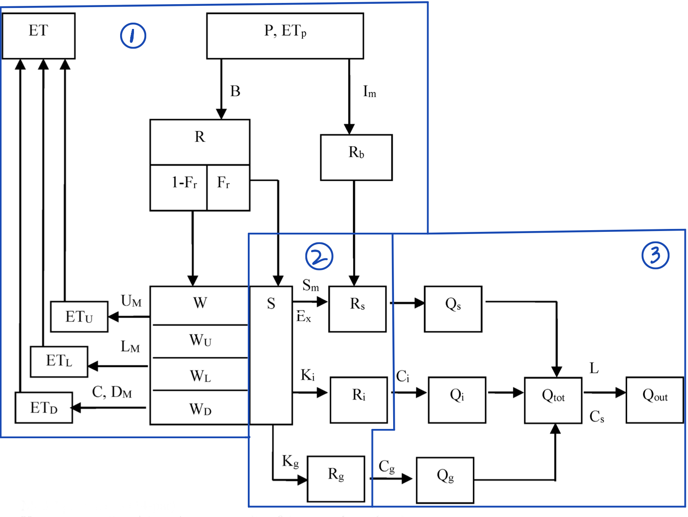

# hydromodel

[](https://pypi.python.org/pypi/hydromodel)
[](https://anaconda.org/conda-forge/hydromodel)

[](https://pyup.io/repos/github/OuyangWenyu/hydromodel)

-   Free software: GNU General Public License v3
-   Documentation: https://OuyangWenyu.github.io/hydromodel

## What is hydromodel

**Hydromodel is a python implementation for common hydrological models such as the XinAnJiang (XAJ) model, which is one of the most famous conceptual hydrological models, especially in Southern China.**

**Not an official version, just for learning**

This is a Python console program (no graphic interface now). It is **still developing**.

## How to run

### Install

We provided a pip package. You can install it with pip:


```Shell
# create python environment
$ conda create -n hydromodel python=3.10
$ conda activate hydromodel
# install hydromodel
$ pip install hydromodel
```

If you want to run the model as a developer, you can clone the repository

```Shell
# fork hydromodel to your GitHub, and clone it to your computer
$ git clone <address of hydromodel in your github>
# move to it
$ cd hydromodel
# if updating from upstream, pull the new version to local
$ git pull
# create python environment
$ mamba env create -f env-dev.yml
# if mamba is not installed:
# $ conda install -c conda-forge mamba
# activate it
$ conda activate hydromodel
```

### Prepare data

You can use the CAMELS dataset (see [here](https://github.com/OuyangWenyu/hydrodataset) to prepare it) to run the model.

If CAMELS is used, you can skip this step.

If the warning "hydro_setting.yml not found" is shown, you can create a hydro_setting.yml file in the user directory. In windows, it is usually "C:/Users/<your_username>". In Linux, it is usually "/home/<your_username>". The content of the file is as follows:

```yaml
# Update the following with your own settings, if you don't have, you can ignore it
minio:
  server_url: ''
  client_endpoint: ''
  access_key: ''
  secret: ''
local_data_path:
  root: ''
  datasets-origin: ''
  datasets-interim: ''
  basins-origin: ''
  basins-interim: ''
postgres:
  server_url: ''
  port: 5432
  username: ''
  password: ''
  database: ''
```


To use your own data to run the model, you need prepare the data in the required format.

**NOTE: We currently only support calibrating one basin at a time, although the following instructions cover multiple basin information, we have not thoroughly tested it.**

We provide some transformation functions in the "scripts" directory. You can use them to transform your data to the required format.

But you still need to do some manual work before transformation. Here are the steps:

1. Put all data in one directory and check if it is organized as the following format:
```
your_data_directory_for_hydromodel/
# one attribute csv file for all basins
├─ basin_attributes.csv
# one timeseries csv file for one basin, xxx and yyy are the basin ids
├─ basin_xxx.csv
├─ basin_yyy.csv
├─ basin_zzz.csv
├─ ...
```
basin_attributes.csv should have the following columns:
```csv
id     name  area(km^2)
xxx  Basin A         100
yyy  Basin B         200
zzz  Basin C         300
```
basin_xxx.csv should have the following columns:
```csv
time  pet(mm/day)  prcp(mm/day)  flow(m^3/s)  et(mm/day)  node1_flow(m^3/s)
2022-01-01 00:00:00            1                 10                 13                 16                 19
2022-01-02 00:00:00            2                 11                 14                 17                 20
2022-01-03 00:00:00            3                 12                 15                 18                 21
```
The sequence of the columns is not important, but the column names should be the same as the above.
No more unnecessary columns are allowed.
For time series csv files, et and node1_flow are optional. If you don't have them, you can ignore them.
The units of all variables could be different, but they cannot be missed and should be put in `()` in the column name.

1. Use [prepare_data.py](https://github.com/OuyangWenyu/hydromodel/tree/master/scripts) -- run the following code to transform the data format to the required format:
```Shell
$ python prepare_data.py --origin_data_dir <your_data_directory_for_hydromodel>
```

### Run the model

To run calibration with CAMLES dataset, you can use the following code:

```Shell
# just an example the hyper-parameters of the model and the algorithm should be tried by yourself
$ python scripts/calibrate_xaj.py --data_type selfmadehydrodataset --data_dir "/ftproot/basins-interim" --exp changdian_61561_time2 --cv_fold 1 --warmup 365 --period 2014-10-01 2021-09-30 --calibrate_period 2014-10-01 2018-09-30 --test_period 2018-10-01 2021-09-30 --basin_id changdian_61561 --model "{\"name\": \"xaj_mz\", \"source_type\": \"sources\", \"source_book\": \"HF\"}" --algorithm "{\"name\": \"SCE_UA\", \"random_seed\": 1234, \"rep\": 5000, \"ngs\": 1000, \"kstop\": 10, \"peps\": 0.1, \"pcento\": 0.1}" --loss "{\"type\": \"time_series\", \"obj_func\": \"RMSE\", \"events\": null}"

$ python scripts/calibrate_xaj.py --data_type selfmadehydrodataset --data_dir "/ftproot/basins-interim" --exp changdian_61561 --cv_fold 1 --warmup 365 --period 2014-10-01 2021-09-30 --calibrate_period 2014-10-01 2019-09-30 --test_period 2019-10-01 2021-09-30 --basin_id changdian_61561 --model "{\"name\": \"xaj_mz\", \"source_type\": \"sources\", \"source_book\": \"HF\"}" --algorithm "{\"name\": \"SCE_UA\", \"random_seed\": 1234, \"rep\": 5000, \"ngs\": 1000, \"kstop\": 50, \"peps\": 0.1, \"pcento\": 0.1}" --loss "{\"type\": \"time_series\", \"obj_func\": \"RMSE\", \"events\": null}"

$ python scripts/calibrate_xaj.py --data_type selfmadehydrodataset --data_dir "/ftproot/basins-interim" --exp changdian_61700 --cv_fold 1 --warmup 365 --period 2014-10-01 2021-09-30 --calibrate_period 2014-10-01 2019-09-30 --test_period 2019-10-01 2021-09-30 --basin_id changdian_61700 --model "{\"name\": \"xaj_mz\", \"source_type\": \"sources\", \"source_book\": \"HF\"}" --algorithm "{\"name\": \"SCE_UA\", \"random_seed\": 1234, \"rep\": 5000, \"ngs\": 1000, \"kstop\": 50, \"peps\": 0.1, \"pcento\": 0.1}" --loss "{\"type\": \"time_series\", \"obj_func\": \"RMSE\", \"events\": null}"

$ python scripts/calibrate_xaj.py --data_type selfmadehydrodataset --data_dir "/ftproot/basins-interim" --exp changdian_61716 --cv_fold 1 --warmup 365 --period 2014-10-01 2021-09-30 --calibrate_period 2014-10-01 2019-09-30 --test_period 2019-10-01 2021-09-30 --basin_id changdian_61716 --model "{\"name\": \"xaj_mz\", \"source_type\": \"sources\", \"source_book\": \"HF\"}" --algorithm "{\"name\": \"SCE_UA\", \"random_seed\": 1234, \"rep\": 5000, \"ngs\": 1000, \"kstop\": 50, \"peps\": 0.1, \"pcento\": 0.1}" --loss "{\"type\": \"time_series\", \"obj_func\": \"RMSE\", \"events\": null}"

$ python scripts/calibrate_xaj.py --data_type selfmadehydrodataset --data_dir "/ftproot/basins-interim" --exp changdian_62618 --cv_fold 1 --warmup 365 --period 2014-10-01 2021-09-30 --calibrate_period 2014-10-01 2019-09-30 --test_period 2019-10-01 2021-09-30 --basin_id changdian_62618 --model "{\"name\": \"xaj_mz\", \"source_type\": \"sources\", \"source_book\": \"HF\"}" --algorithm "{\"name\": \"SCE_UA\", \"random_seed\": 1234, \"rep\": 5000, \"ngs\": 1000, \"kstop\": 50, \"peps\": 0.1, \"pcento\": 0.1}" --loss "{\"type\": \"time_series\", \"obj_func\": \"RMSE\", \"events\": null}"

$ python scripts/calibrate_xaj.py --data_type selfmadehydrodataset --data_dir "/ftproot/basins-interim" --exp changdian_91000 --cv_fold 1 --warmup 365 --period 2014-10-01 2021-09-30 --calibrate_period 2014-10-01 2019-09-30 --test_period 2019-10-01 2021-09-30 --basin_id changdian_91000 --model "{\"name\": \"xaj_mz\", \"source_type\": \"sources\", \"source_book\": \"HF\"}" --algorithm "{\"name\": \"SCE_UA\", \"random_seed\": 1234, \"rep\": 5000, \"ngs\": 1000, \"kstop\": 50, \"peps\": 0.1, \"pcento\": 0.1}" --loss "{\"type\": \"time_series\", \"obj_func\": \"RMSE\", \"events\": null}"
```

To use your own data, run the following code:

```Shell
# you can change the algorithm parameters:
$ python calibrate_xaj.py --data_type owndata --data_dir "C:/Users/wenyu/OneDrive/data/biliuhe" --exp expbiliuhe001 --cv_fold 1 --warmup 720 --period "2012-06-10 00:00" "2022-08-31 23:00" --calibrate_period "2012-06-10 00:00" "2017-08-31 23:00" --test_period "2017-09-01 00:00" "2022-08-31 23:00" --basin_id 21401550 --model "{\"name\": \"xaj\", \"source_type\": \"sources5mm\", \"source_book\": \"HF\"}" --param_range_file "C:/Users/wenyu/OneDrive/data/biliuhe/param_range.yaml" --algorithm "{\"name\": \"SCE_UA\", \"random_seed\": 1234, \"rep\": 10, \"ngs\": 10, \"kstop\": 5, \"peps\": 0.1, \"pcento\": 0.1}" --loss "{\"type\": \"time_series\", \"obj_func\": \"RMSE\", \"events\": null}"
# for advices of hyper-parameters of sceua, please see the comment of the function 'calibrate_xaj.py'
```

**NOTE**: For the parameter range in the `param_range_file` file. You can copy it from "hydromodel/models/param.yaml" of this repo and put it anywhere you want. Then you can modify the parameter range in the file. The parameter range is used to limit the parameter space of the hydromodels. If you don't provide the file, the default parameter range will be used.

Then you can evaluate the calibrated model with the following code:

```Shell
# $ python evaluate_xaj.py --exp expcamels001
# for your own data
$ python scripts/evaluate_xaj.py --exp changdian_61561

$ python scripts/evaluate_xaj.py --exp changdian_61700

$ python scripts/evaluate_xaj.py --exp changdian_61716

$ python scripts/evaluate_xaj.py --exp changdian_62618

$ python scripts/evaluate_xaj.py --exp changdian_91000
```

### See the results

Run the following code to see the results of the evaluation:

```Shell
# $ python visualize.py --exp expcamels001
# for your own data
$ python scripts/visualize.py --exp changdian_61561

$ python scripts/visualize.py --exp changdian_61700

$ python scripts/visualize.py --exp changdian_61716

$ python scripts/visualize.py --exp changdian_62618

$ python scripts/visualize.py --exp changdian_91000
```

You will see the results in the `example` directory.

## Why does hydro-model-xaj exist

When we want to learn about the rainfall-runoff process and make forecasts for floods, etc. We often use classic hydrological
models such as XAJ as a baseline because it is trusted by many engineers and researchers. However, after searching the website very few repositories could be found. One day I happened to start learning Python, so I decided to implement the
model with Python. Previous commits for hydro-model-xaj have some errors, but now at least one executable version is
provided.

Actually open-source science has brought a great impact on hydrological modeling. For example, SWAT and VIC are very
popular now as they are public with great performance and readable documents; as more and more people use them, they
become more stable and powerful. XAJ is a nice model used by many engineers for practical production. We need to inherit
and develop it. I think hydro-model-xaj is a good start.

## What are the main features

We basically implement the formula in this book
-- [《流域水文模拟》](https://xueshu.baidu.com/usercenter/paper/show?paperid=ad9c545a7baa43321db97f5f16d393bf&site=xueshu_se)

Other reference Chinese books：

- ["*Principles of
  Hydrology*"/《水文学原理》](https://xueshu.baidu.com/usercenter/paper/show?paperid=5b2d0a40e2d2804f47346ae6ccf2d142&site=xueshu_se)
- ["*Hydrologic
  Forecasting*"/《水文预报》](https://xueshu.baidu.com/usercenter/paper/show?paperid=852a9a90a7d26c5fae749169f87b61e0&site=xueshu_se)
- ["*Engineering
  Hydrology*"/《工程水文学》](https://xueshu.baidu.com/usercenter/paper/show?paperid=6e2d38726c8e3c0b9f3a14bafb156481&site=xueshu_se)

More English references could be seen at the end of this README file.

The model mainly includes three parts:



For the first part, we use an evaporation coefficient K (ratio of potential evapotranspiration to reference crop
evaporation generally from Allen, 1998) rather than Kc (the ratio of potential evapotranspiration to pan evaporation)
because we often use potential evapotranspiration data from a system like GLDAS, NLDAS, etc. But it doesn't matter, when
you use pan evaporation, just treat K as Kc.

For the second part, we provide multiple implementations, because, for this module, formulas in different books are a
little different. One simplest version is chosen as a default setting. More details could be seen in the source code directly now. We provide four versions, two versions from two books.

For the third part -- routing module, we provide different ways: the default is a common way with recession constant (
CS) and lag time (L) shown in the figure; second (You can set the model's name as "xaj_mz" to use it) is a model
from [mizuRoute](http://www.geosci-model-dev.net/9/2223/2016/) to generate unit hydrograph for surface runoff (Rs -> Qs)
, as its parameters are easier to set, and we can optimize all parameters in a uniform way.

We provide two common calibration methods to optimize XAJ's parameters:

- [SCE-UA](https://doi.org/10.1029/91WR02985) from [spotpy](https://github.com/thouska/spotpy)
- [GA](https://en.wikipedia.org/wiki/Genetic_algorithm) from [DEAP](https://github.com/DEAP/deap): now only the method
  is used, but no completed case is provided yet. We will provide one soon.

Now the model is only for **one computing element** (typically, a headwater catchment). Soon we will provide calibration
for multiple headwater catchments. To get a better simulation for large basins, a (semi-)distributed version may be
needed, and it is not implemented yet. The following links may be useful:

- https://github.com/ecoon/watershed-workflow
- https://github.com/ConnectedSystems/Streamfall.jl

We also provide a differentiable version of XAJ, which is based on the [PyTorch](https://pytorch.org/) framework.

The idea comes from this paper: [From calibration to parameter learning: Harnessing the scaling effects of big data in geoscientific modeling](http://dx.doi.org/10.1038/s41467-021-26107-z) by Tsai et al. (2021). We use the same structure as the original XAJ model but replace the original Numpy code with PyTorch. Then we can use the automatic differentiation technique and stochastic gradient descent algorithms to optimize all parameters. The advantage of this method is that we can use the same code to optimize many basins at once and use big data to improve the model performance. Generally, with the native parallel computing ability of PyTorch, the differentiable version is faster than the original version without any parallel processing. The differentiable version is in [torchhydro](https://github.com/OuyangWenyu/torchhydro).

Other implementations for XAJ:

- Matlab: https://github.com/wknoben/MARRMoT/blob/master/MARRMoT/Models/Model%20files/m_28_xinanjiang_12p_4s.m
- Java: https://github.com/wfxr/xaj-hydrological-model
- R, C++: https://github.com/Sibada/XAJ

## How to contribute

If you want to add features for hydro-model-xaj, for example, write a distributed version for XAJ, please create a new
git branch for your feature and send me a pull request.

If you find any problems in hydro-model-xaj, please post your questions
on [issues](https://github.com/OuyangWenyu/hydro-model-xaj/issues).

## References

- Allen, R.G., L. Pereira, D. Raes, and M. Smith, 1998. Crop Evapotranspiration, Food and Agriculture Organization of
  the United Nations, Rome, Italy. FAO publication 56. ISBN 92-5-104219-5. 290p.
- Duan, Q., Sorooshian, S., and Gupta, V. (1992), Effective and efficient global optimization for conceptual
  rainfall-runoff models, Water Resour. Res., 28( 4), 1015– 1031, doi:10.1029/91WR02985.
- François-Michel De Rainville, Félix-Antoine Fortin, Marc-André Gardner, Marc Parizeau, and Christian Gagné. 2012.
  DEAP: a python framework for evolutionary algorithms. In Proceedings of the 14th annual conference companion on
  Genetic and evolutionary computation (GECCO '12). Association for Computing Machinery, New York, NY, USA, 85–92.
  DOI:https://doi.org/10.1145/2330784.2330799
- Houska T, Kraft P, Chamorro-Chavez A, Breuer L (2015) SPOTting Model Parameters Using a Ready-Made Python Package.
  PLoS ONE 10(12): e0145180. https://doi.org/10.1371/journal.pone.0145180
- Mizukami, N., Clark, M. P., Sampson, K., Nijssen, B., Mao, Y., McMillan, H., Viger, R. J., Markstrom, S. L., Hay, L.
  E., Woods, R., Arnold, J. R., and Brekke, L. D.: mizuRoute version 1: a river network routing tool for a continental
  domain water resources applications, Geosci. Model Dev., 9, 2223–2238, https://doi.org/10.5194/gmd-9-2223-2016, 2016.
- Zhao, R.J., Zhuang, Y. L., Fang, L. R., Liu, X. R., Zhang, Q. S. (ed) (1980) The Xinanjiang model, Hydrological
  Forecasting Proc., Oxford Symp., IAHS Publication, Wallingford, U.K.
- Zhao, R.J., 1992. The xinanjiang model applied in China. J Hydrol 135 (1–4), 371–381.
